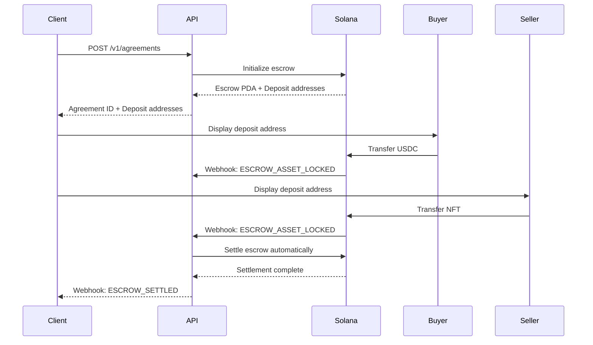
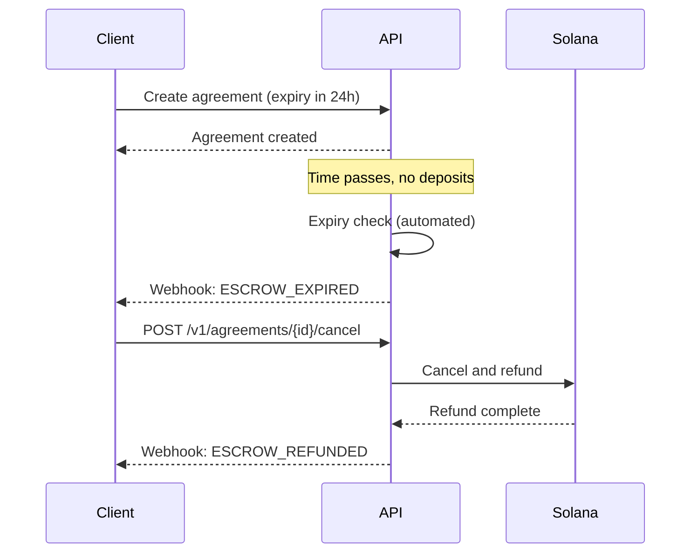

# EasyEscrow.ai API Integration Guide

## Table of Contents

1. [Getting Started](#getting-started)
2. [Authentication](#authentication)
3. [Quick Start Example](#quick-start-example)
4. [Core Workflows](#core-workflows)
5. [Code Examples](#code-examples)
6. [SDK Integration](#sdk-integration)
7. [Best Practices](#best-practices)
8. [Testing](#testing)
9. [Production Checklist](#production-checklist)

---

## Getting Started

### Prerequisites

- Node.js 16+ or equivalent runtime
- Solana wallet with SOL for transaction fees
- Understanding of escrow and NFT concepts
- USDC tokens (mainnet or devnet)

### Base URLs

| Environment | URL | Purpose |
|-------------|-----|---------|
| Development | `http://localhost:3000` | Local development |
| Devnet | `https://devnet-api.easyescrow.ai` | Testing with devnet tokens |
| Mainnet | `https://api.easyescrow.ai` | Production |

### Rate Limits

| Endpoint Type | Rate Limit | Window |
|---------------|------------|--------|
| Standard | 100 requests | 15 minutes |
| Strict (Agreement Creation) | 10 requests | 15 minutes |

---

## Authentication

Currently, the API is open for testing. Future versions will require API key authentication.

### Future Authentication (Coming Soon)

```typescript
const headers = {
  'Content-Type': 'application/json',
  'X-API-Key': process.env.EASYESCROW_API_KEY,
};
```

---

## Quick Start Example

### Complete Escrow Flow in TypeScript

```typescript
import { Connection, PublicKey, Keypair } from '@solana/web3.js';

// Configuration
const API_BASE_URL = 'https://api.easyescrow.ai';
const USDC_MINT_MAINNET = 'EPjFWdd5AufqSSqeM2qN1xzybapC8G4wEGGkZwyTDt1v';

// 1. Create an escrow agreement
async function createEscrowAgreement() {
  const agreementData = {
    nftMint: '7xKXtg2CW87d97TXJSDpbD5jBkheTqA83TZRuJosgAsU',
    price: '1000000000', // 1000 USDC (6 decimals)
    seller: 'SellerPublicKey...',
    buyer: 'BuyerPublicKey...',
    expiry: new Date(Date.now() + 24 * 60 * 60 * 1000).toISOString(), // 24 hours
    feeBps: 250, // 2.5% platform fee
    honorRoyalties: true,
  };

  const response = await fetch(`${API_BASE_URL}/v1/agreements`, {
    method: 'POST',
    headers: {
      'Content-Type': 'application/json',
      'X-Idempotency-Key': generateIdempotencyKey(),
    },
    body: JSON.stringify(agreementData),
  });

  if (!response.ok) {
    throw new Error(`Failed to create agreement: ${response.statusText}`);
  }

  const result = await response.json();
  console.log('Agreement created:', result.data);
  
  return result.data;
}

// 2. Monitor agreement status
async function checkAgreementStatus(agreementId: string) {
  const response = await fetch(`${API_BASE_URL}/v1/agreements/${agreementId}`);
  
  if (!response.ok) {
    throw new Error(`Failed to get agreement: ${response.statusText}`);
  }

  const result = await response.json();
  return result.data;
}

// 3. Generate idempotency key
function generateIdempotencyKey(): string {
  return `${Date.now()}-${Math.random().toString(36).substring(7)}`;
}

// Usage
(async () => {
  try {
    // Create agreement
    const agreement = await createEscrowAgreement();
    console.log('Agreement ID:', agreement.agreementId);
    console.log('USDC Deposit Address:', agreement.depositAddresses.usdc);
    console.log('NFT Deposit Address:', agreement.depositAddresses.nft);
    
    // Check status
    const status = await checkAgreementStatus(agreement.agreementId);
    console.log('Current status:', status.status);
    console.log('USDC Locked:', status.balances.usdcLocked);
    console.log('NFT Locked:', status.balances.nftLocked);
    
  } catch (error) {
    console.error('Error:', error);
  }
})();
```

---

## Core Workflows

### Workflow 1: Create and Complete Escrow



### Workflow 2: Handle Expiry and Refunds



---

## Code Examples

### TypeScript/Node.js

#### Complete Integration Class

```typescript
import fetch from 'node-fetch';

interface CreateAgreementRequest {
  nftMint: string;
  price: string;
  seller: string;
  buyer?: string;
  expiry: string;
  feeBps: number;
  honorRoyalties: boolean;
}

interface Agreement {
  agreementId: string;
  status: string;
  escrowPda: string;
  depositAddresses: {
    usdc: string;
    nft: string;
  };
  // ... other fields
}

class EasyEscrowClient {
  constructor(
    private baseUrl: string = 'https://api.easyescrow.ai',
    private apiKey?: string
  ) {}

  private async request<T>(
    path: string,
    options: RequestInit = {}
  ): Promise<T> {
    const headers: Record<string, string> = {
      'Content-Type': 'application/json',
      ...((options.headers as Record<string, string>) || {}),
    };

    if (this.apiKey) {
      headers['X-API-Key'] = this.apiKey;
    }

    const response = await fetch(`${this.baseUrl}${path}`, {
      ...options,
      headers,
    });

    if (!response.ok) {
      const error = await response.json();
      throw new Error(error.message || 'API request failed');
    }

    const result = await response.json();
    return result.data || result;
  }

  async createAgreement(
    request: CreateAgreementRequest,
    idempotencyKey?: string
  ): Promise<Agreement> {
    return this.request<Agreement>('/v1/agreements', {
      method: 'POST',
      headers: idempotencyKey
        ? { 'X-Idempotency-Key': idempotencyKey }
        : {},
      body: JSON.stringify(request),
    });
  }

  async getAgreement(agreementId: string): Promise<Agreement> {
    return this.request<Agreement>(`/v1/agreements/${agreementId}`);
  }

  async listAgreements(filters?: {
    status?: string;
    seller?: string;
    buyer?: string;
    page?: number;
    limit?: number;
  }): Promise<{ agreements: Agreement[]; pagination: any }> {
    const params = new URLSearchParams(
      filters as Record<string, string>
    ).toString();
    return this.request<any>(`/v1/agreements?${params}`);
  }

  async cancelAgreement(agreementId: string): Promise<any> {
    return this.request(`/v1/agreements/${agreementId}/cancel`, {
      method: 'POST',
    });
  }

  async getReceipt(agreementId: string): Promise<any> {
    return this.request(`/v1/receipts/agreement/${agreementId}`);
  }

  async verifyReceipt(receiptId: string): Promise<any> {
    return this.request(`/v1/receipts/${receiptId}/verify`, {
      method: 'POST',
    });
  }

  async getTransactions(agreementId: string): Promise<any> {
    return this.request(`/v1/transactions/agreements/${agreementId}`);
  }
}

// Usage
const client = new EasyEscrowClient('https://api.easyescrow.ai');

(async () => {
  // Create agreement
  const agreement = await client.createAgreement({
    nftMint: '7xKXtg2CW87d97TXJSDpbD5jBkheTqA83TZRuJosgAsU',
    price: '1000000000',
    seller: 'SellerPubkey...',
    expiry: new Date(Date.now() + 24 * 60 * 60 * 1000).toISOString(),
    feeBps: 250,
    honorRoyalties: true,
  });

  console.log('Agreement created:', agreement.agreementId);

  // Check status
  const status = await client.getAgreement(agreement.agreementId);
  console.log('Status:', status.status);

  // Get transactions
  const txs = await client.getTransactions(agreement.agreementId);
  console.log('Transactions:', txs.transactions.length);
})();
```

### Python

```python
import requests
from typing import Dict, Optional
from datetime import datetime, timedelta

class EasyEscrowClient:
    def __init__(self, base_url: str = "https://api.easyescrow.ai", api_key: Optional[str] = None):
        self.base_url = base_url
        self.api_key = api_key
        self.session = requests.Session()
        
        if api_key:
            self.session.headers.update({"X-API-Key": api_key})
    
    def create_agreement(
        self,
        nft_mint: str,
        price: str,
        seller: str,
        expiry: str,
        fee_bps: int = 250,
        buyer: Optional[str] = None,
        honor_royalties: bool = True,
        idempotency_key: Optional[str] = None
    ) -> Dict:
        """Create a new escrow agreement"""
        
        headers = {}
        if idempotency_key:
            headers["X-Idempotency-Key"] = idempotency_key
        
        data = {
            "nftMint": nft_mint,
            "price": price,
            "seller": seller,
            "expiry": expiry,
            "feeBps": fee_bps,
            "honorRoyalties": honor_royalties,
        }
        
        if buyer:
            data["buyer"] = buyer
        
        response = self.session.post(
            f"{self.base_url}/v1/agreements",
            json=data,
            headers=headers
        )
        response.raise_for_status()
        
        return response.json()["data"]
    
    def get_agreement(self, agreement_id: str) -> Dict:
        """Get agreement details"""
        response = self.session.get(f"{self.base_url}/v1/agreements/{agreement_id}")
        response.raise_for_status()
        return response.json()["data"]
    
    def list_agreements(
        self,
        status: Optional[str] = None,
        seller: Optional[str] = None,
        buyer: Optional[str] = None,
        page: int = 1,
        limit: int = 20
    ) -> Dict:
        """List agreements with filters"""
        params = {"page": page, "limit": limit}
        
        if status:
            params["status"] = status
        if seller:
            params["seller"] = seller
        if buyer:
            params["buyer"] = buyer
        
        response = self.session.get(f"{self.base_url}/v1/agreements", params=params)
        response.raise_for_status()
        return response.json()
    
    def cancel_agreement(self, agreement_id: str) -> Dict:
        """Cancel an expired agreement"""
        response = self.session.post(f"{self.base_url}/v1/agreements/{agreement_id}/cancel")
        response.raise_for_status()
        return response.json()["data"]
    
    def get_receipt(self, agreement_id: str) -> Dict:
        """Get receipt for settled agreement"""
        response = self.session.get(f"{self.base_url}/v1/receipts/agreement/{agreement_id}")
        response.raise_for_status()
        return response.json()["data"]

# Usage
client = EasyEscrowClient("https://api.easyescrow.ai")

# Create agreement
expiry = (datetime.now() + timedelta(hours=24)).isoformat()
agreement = client.create_agreement(
    nft_mint="7xKXtg2CW87d97TXJSDpbD5jBkheTqA83TZRuJosgAsU",
    price="1000000000",
    seller="SellerPubkey...",
    expiry=expiry,
    fee_bps=250
)

print(f"Agreement ID: {agreement['agreementId']}")
print(f"USDC Deposit: {agreement['depositAddresses']['usdc']}")
print(f"NFT Deposit: {agreement['depositAddresses']['nft']}")

# Check status
status = client.get_agreement(agreement["agreementId"])
print(f"Status: {status['status']}")
```

### JavaScript (Browser)

```javascript
class EasyEscrowClient {
  constructor(baseUrl = 'https://api.easyescrow.ai', apiKey = null) {
    this.baseUrl = baseUrl;
    this.apiKey = apiKey;
  }

  async request(path, options = {}) {
    const headers = {
      'Content-Type': 'application/json',
      ...options.headers,
    };

    if (this.apiKey) {
      headers['X-API-Key'] = this.apiKey;
    }

    const response = await fetch(`${this.baseUrl}${path}`, {
      ...options,
      headers,
    });

    if (!response.ok) {
      const error = await response.json();
      throw new Error(error.message || 'API request failed');
    }

    const result = await response.json();
    return result.data || result;
  }

  async createAgreement(data, idempotencyKey = null) {
    const headers = {};
    if (idempotencyKey) {
      headers['X-Idempotency-Key'] = idempotencyKey;
    }

    return this.request('/v1/agreements', {
      method: 'POST',
      headers,
      body: JSON.stringify(data),
    });
  }

  async getAgreement(agreementId) {
    return this.request(`/v1/agreements/${agreementId}`);
  }

  async listAgreements(filters = {}) {
    const params = new URLSearchParams(filters).toString();
    return this.request(`/v1/agreements?${params}`);
  }

  async getReceipt(agreementId) {
    return this.request(`/v1/receipts/agreement/${agreementId}`);
  }
}

// Usage in React component
function EscrowComponent() {
  const [agreement, setAgreement] = React.useState(null);
  const [status, setStatus] = React.useState('idle');
  const client = new EasyEscrowClient();

  const createEscrow = async () => {
    setStatus('creating');
    try {
      const result = await client.createAgreement({
        nftMint: '7xKXtg2CW87d97TXJSDpbD5jBkheTqA83TZRuJosgAsU',
        price: '1000000000',
        seller: walletAddress,
        expiry: new Date(Date.now() + 24 * 60 * 60 * 1000).toISOString(),
        feeBps: 250,
        honorRoyalties: true,
      });
      
      setAgreement(result);
      setStatus('created');
    } catch (error) {
      console.error('Failed to create escrow:', error);
      setStatus('error');
    }
  };

  return (
    <div>
      <button onClick={createEscrow} disabled={status === 'creating'}>
        Create Escrow
      </button>
      {agreement && (
        <div>
          <p>Agreement ID: {agreement.agreementId}</p>
          <p>USDC Deposit: {agreement.depositAddresses.usdc}</p>
          <p>NFT Deposit: {agreement.depositAddresses.nft}</p>
        </div>
      )}
    </div>
  );
}
```

---

## SDK Integration

### Installing Dependencies

```bash
# Node.js
npm install @solana/web3.js @solana/spl-token

# Python
pip install solana requests

# PHP
composer require solana/web3.js guzzlehttp/guzzle
```

### Solana Integration

#### Monitoring Deposit Addresses

```typescript
import { Connection, PublicKey } from '@solana/web3.js';

async function monitorDeposits(
  connection: Connection,
  depositAddress: string,
  callback: (signature: string) => void
) {
  const pubkey = new PublicKey(depositAddress);
  
  // Subscribe to account changes
  const subscriptionId = connection.onAccountChange(
    pubkey,
    (accountInfo, context) => {
      console.log('Account changed:', accountInfo);
      callback(context.slot.toString());
    },
    'confirmed'
  );
  
  return subscriptionId;
}

// Usage
const connection = new Connection('https://api.mainnet-beta.solana.com');
const subscriptionId = await monitorDeposits(
  connection,
  agreement.depositAddresses.usdc,
  (signature) => {
    console.log('Deposit detected:', signature);
    // Refresh agreement status
  }
);

// Cleanup
// connection.removeAccountChangeListener(subscriptionId);
```

---

## Best Practices

### 1. Idempotency

Always use idempotency keys for agreement creation:

```typescript
function generateIdempotencyKey(agreementData: any): string {
  // Use deterministic key based on request data
  const hash = crypto
    .createHash('sha256')
    .update(JSON.stringify(agreementData))
    .digest('hex');
  return `agreement-${hash}`;
}

const idempotencyKey = generateIdempotencyKey(agreementData);
const agreement = await client.createAgreement(agreementData, idempotencyKey);
```

### 2. Error Handling

Implement comprehensive error handling:

```typescript
async function createAgreementSafe(data: CreateAgreementRequest): Promise<Agreement | null> {
  try {
    return await client.createAgreement(data);
  } catch (error: any) {
    if (error.status === 429) {
      // Rate limited - wait and retry
      await sleep(60000);
      return createAgreementSafe(data);
    }
    
    if (error.status === 500) {
      // Server error - retry with backoff
      return retryWithBackoff(() => client.createAgreement(data));
    }
    
    // Client error - don't retry
    console.error('Failed to create agreement:', error.message);
    return null;
  }
}
```

### 3. Polling vs Webhooks

**Use Webhooks** (Recommended):
```typescript
// Set up webhook endpoint to receive real-time updates
app.post('/webhooks/escrow', handleWebhook);
```

**Polling** (Fallback):
```typescript
async function pollAgreementStatus(agreementId: string): Promise<string> {
  const maxAttempts = 60;
  const interval = 5000; // 5 seconds
  
  for (let i = 0; i < maxAttempts; i++) {
    const agreement = await client.getAgreement(agreementId);
    
    if (agreement.status === 'SETTLED' || agreement.status === 'CANCELLED') {
      return agreement.status;
    }
    
    await sleep(interval);
  }
  
  throw new Error('Polling timeout');
}
```

### 4. Caching

Cache frequently accessed data:

```typescript
import { LRUCache } from 'lru-cache';

const cache = new LRUCache<string, Agreement>({
  max: 500,
  ttl: 1000 * 60 * 5, // 5 minutes
});

async function getAgreementCached(agreementId: string): Promise<Agreement> {
  const cached = cache.get(agreementId);
  if (cached) return cached;
  
  const agreement = await client.getAgreement(agreementId);
  cache.set(agreementId, agreement);
  return agreement;
}
```

---

## Testing

### Test Environment Setup

```typescript
// Use devnet for testing
const TEST_CONFIG = {
  baseUrl: 'https://devnet-api.easyescrow.ai',
  usdcMint: '4zMMC9srt5Ri5X14GAgXhaHii3GnPAEERYPJgZJDncDU', // Devnet USDC
  rpcUrl: 'https://api.devnet.solana.com',
};

const testClient = new EasyEscrowClient(TEST_CONFIG.baseUrl);
```

### Integration Tests

```typescript
import { describe, it, expect } from '@jest/globals';

describe('EasyEscrow Integration', () => {
  it('should create and cancel an agreement', async () => {
    // Create agreement
    const agreement = await testClient.createAgreement({
      nftMint: TEST_NFT_MINT,
      price: '1000000',
      seller: TEST_SELLER,
      expiry: new Date(Date.now() + 1000).toISOString(), // Expires in 1 second
      feeBps: 250,
      honorRoyalties: true,
    });
    
    expect(agreement.agreementId).toBeDefined();
    
    // Wait for expiry
    await sleep(2000);
    
    // Cancel agreement
    const result = await testClient.cancelAgreement(agreement.agreementId);
    expect(result.status).toBe('CANCELLED');
  });
});
```

---

## Production Checklist

Before going live:

- [ ] **Environment Configuration**
  - [ ] Use mainnet USDC mint address
  - [ ] Set production API base URL
  - [ ] Configure production Solana RPC endpoint
  - [ ] Set up environment variables

- [ ] **Error Handling**
  - [ ] Implement retry logic for transient errors
  - [ ] Set up error logging and monitoring
  - [ ] Handle rate limits gracefully
  - [ ] Display user-friendly error messages

- [ ] **Security**
  - [ ] Verify webhook signatures
  - [ ] Implement idempotency for all mutations
  - [ ] Validate all user inputs
  - [ ] Use HTTPS for all API calls

- [ ] **Monitoring**
  - [ ] Set up health check monitoring
  - [ ] Configure alerts for failures
  - [ ] Track API usage and rate limits
  - [ ] Monitor webhook delivery success rate

- [ ] **Testing**
  - [ ] Test complete escrow flow on devnet
  - [ ] Verify webhook handling
  - [ ] Test error scenarios
  - [ ] Load test your integration

- [ ] **Documentation**
  - [ ] Document your integration for your team
  - [ ] Prepare runbooks for common issues
  - [ ] Set up support escalation process

---

## Additional Resources

- [OpenAPI Specification](./openapi.yaml)
- [Webhook Events](./WEBHOOK_EVENTS.md)
- [Error Codes](./ERROR_CODES.md)
- [API Reference](https://docs.easyescrow.ai)

---

## Support

For integration support:
- Email: support@easyescrow.ai
- Discord: [Join our community](https://discord.gg/easyescrow)
- Documentation: https://docs.easyescrow.ai

---

## Changelog

| Version | Date | Changes |
|---------|------|---------|
| 1.0.0 | 2024-01-15 | Initial integration guide |

