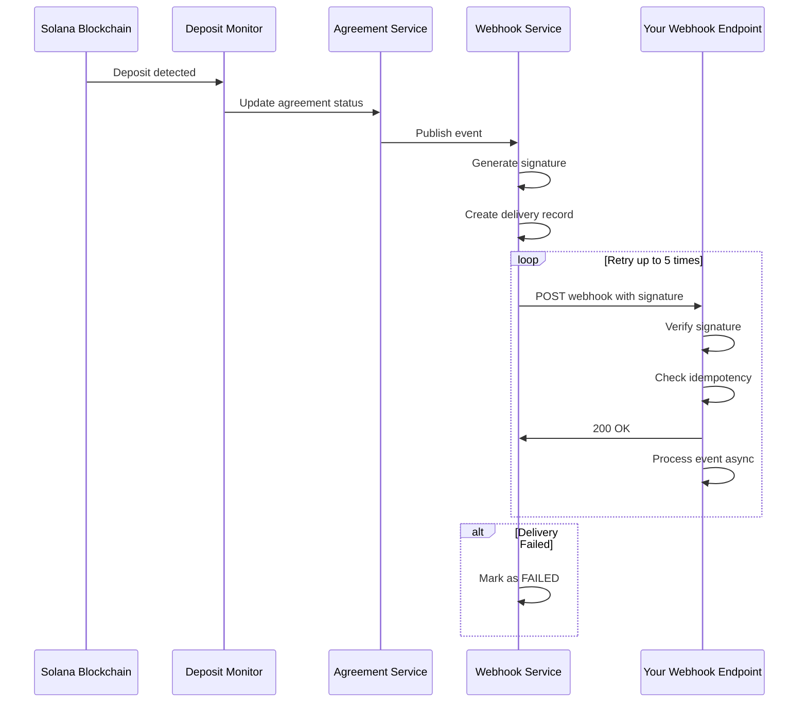

# Webhook Events Documentation

## Overview

EasyEscrow.ai provides real-time webhook notifications for all escrow lifecycle events. Webhooks enable your application to respond immediately to state changes without polling.

## Features

- **Reliable Delivery**: Automatic retry with exponential backoff (up to 5 attempts)
- **Secure**: HMAC-SHA256 signature verification
- **Comprehensive**: Coverage of all escrow lifecycle events
- **Asynchronous**: Non-blocking event processing
- **Trackable**: Full delivery history and status tracking

## Configuration

### Environment Variables

Configure webhook endpoints using environment variables:

```env
# Single webhook endpoint
WEBHOOK_URL=https://your-domain.com/api/webhooks/escrow
WEBHOOK_SECRET=your-secret-key-minimum-16-chars-recommended-32
WEBHOOK_EVENTS=ESCROW_FUNDED,ESCROW_SETTLED  # Optional: comma-separated list, defaults to all events
```

### Programmatic Registration

Register multiple webhook endpoints programmatically:

```typescript
import { webhookService } from './services/webhook.service';

webhookService.registerWebhook({
  id: 'production-webhook',
  url: 'https://prod.example.com/webhooks/escrow',
  secret: process.env.WEBHOOK_SECRET_PROD,
  events: ['ESCROW_SETTLED', 'ESCROW_REFUNDED'],
  enabled: true,
});

webhookService.registerWebhook({
  id: 'monitoring-webhook',
  url: 'https://monitoring.example.com/webhooks',
  secret: process.env.WEBHOOK_SECRET_MONITORING,
  events: ['ESCROW_EXPIRED', 'ESCROW_REFUNDED'],
  enabled: true,
});
```

## Event Types

### 1. ESCROW_FUNDED

Triggered when the first deposit (USDC or NFT) is received for an escrow agreement.

**Event Type**: `ESCROW_FUNDED`

**Payload**:
```json
{
  "eventType": "ESCROW_FUNDED",
  "timestamp": "2024-01-15T10:30:00.000Z",
  "agreementId": "AGR-1234567890",
  "price": "1000000000",
  "seller": "7xKXtg2CW87d97TXJSDpbD5jBkheTqA83TZRuJosgAsU",
  "buyer": "5rxZ9Z9Z9Z9Z9Z9Z9Z9Z9Z9Z9Z9Z9Z9Z9Z9Z9Z9Z9",
  "nftMint": "NFTMintAddress123456789",
  "escrowPda": "EscrowPDAAddress123456789"
}
```

**Use Cases**:
- Notify the seller that a buyer has started the purchase process
- Update UI to show escrow is partially funded
- Trigger analytics events

---

### 2. ESCROW_ASSET_LOCKED

Triggered when USDC or NFT is successfully locked in the escrow.

**Event Type**: `ESCROW_ASSET_LOCKED`

**Payload**:
```json
{
  "eventType": "ESCROW_ASSET_LOCKED",
  "timestamp": "2024-01-15T10:35:00.000Z",
  "agreementId": "AGR-1234567890",
  "assetType": "USDC",
  "depositor": "5rxZ9Z9Z9Z9Z9Z9Z9Z9Z9Z9Z9Z9Z9Z9Z9Z9Z9Z9Z9",
  "amount": "1000000000",
  "tokenAccount": "TokenAccountAddress123456789",
  "txId": "5KqZ9Z9Z9Z9Z9Z9Z9Z9Z9Z9Z9Z9Z9Z9Z9Z9Z9Z9Z9Z9Z9"
}
```

**Asset Types**:
- `USDC`: USDC payment has been locked
- `NFT`: NFT has been locked

**Use Cases**:
- Notify the other party that their counterpart has deposited
- Update escrow status in your application
- Trigger automatic settlement when both assets are locked

---

### 3. ESCROW_SETTLED

Triggered when the escrow is successfully settled and all parties receive their assets.

**Event Type**: `ESCROW_SETTLED`

**Payload**:
```json
{
  "eventType": "ESCROW_SETTLED",
  "timestamp": "2024-01-15T10:40:00.000Z",
  "agreementId": "AGR-1234567890",
  "nftMint": "NFTMintAddress123456789",
  "price": "1000000000",
  "platformFee": "25000000",
  "creatorRoyalty": "50000000",
  "sellerReceived": "925000000",
  "buyer": "5rxZ9Z9Z9Z9Z9Z9Z9Z9Z9Z9Z9Z9Z9Z9Z9Z9Z9Z9Z9",
  "seller": "7xKXtg2CW87d97TXJSDpbD5jBkheTqA83TZRuJosgAsU",
  "settleTxId": "SettlementTxSignature123456789"
}
```

**Financial Breakdown**:
- `price`: Total USDC amount locked in escrow
- `platformFee`: Fee collected by the platform (in basis points from agreement)
- `creatorRoyalty`: Royalty paid to NFT creator (if `honorRoyalties` is true)
- `sellerReceived`: Net amount received by seller (price - platformFee - creatorRoyalty)

**Use Cases**:
- Send confirmation emails to buyer and seller
- Update order status to "completed"
- Generate and display receipt
- Update NFT ownership records
- Trigger payout processing

---

### 4. ESCROW_EXPIRED

Triggered when an escrow agreement expires without both assets being locked.

**Event Type**: `ESCROW_EXPIRED`

**Payload**:
```json
{
  "eventType": "ESCROW_EXPIRED",
  "timestamp": "2024-01-15T23:59:59.000Z",
  "agreementId": "AGR-1234567890",
  "expiry": "2024-01-15T23:59:59.000Z",
  "status": "USDC_LOCKED"
}
```

**Status Values**:
- `PENDING_DEPOSITS`: No deposits received
- `USDC_LOCKED`: Only USDC was deposited
- `NFT_LOCKED`: Only NFT was deposited

**Use Cases**:
- Notify parties that the escrow has expired
- Trigger automatic refund process
- Update order status to "expired"
- Send reminder to complete deposits before expiry

---

### 5. ESCROW_REFUNDED

Triggered when an escrow is cancelled and funds/NFTs are refunded to depositors.

**Event Type**: `ESCROW_REFUNDED`

**Payload**:
```json
{
  "eventType": "ESCROW_REFUNDED",
  "timestamp": "2024-01-16T00:05:00.000Z",
  "agreementId": "AGR-1234567890",
  "cancelTxId": "CancelTxSignature123456789",
  "refundedTo": "5rxZ9Z9Z9Z9Z9Z9Z9Z9Z9Z9Z9Z9Z9Z9Z9Z9Z9Z9Z9",
  "amount": "1000000000",
  "assetType": "USDC"
}
```

**Use Cases**:
- Notify depositor that their assets have been returned
- Update order status to "cancelled"
- Log refund transaction for accounting
- Clear pending transactions

---

## Webhook Security

### Signature Verification

All webhook requests include an `X-Webhook-Signature` header containing an HMAC-SHA256 signature of the request payload. **You must verify this signature** to ensure the webhook came from EasyEscrow.ai.

#### Node.js/TypeScript Example

```typescript
import crypto from 'crypto';

function verifyWebhookSignature(
  payload: string,
  signature: string,
  secret: string
): boolean {
  const expectedSignature = crypto
    .createHmac('sha256', secret)
    .update(payload)
    .digest('hex');
  
  // Use timing-safe comparison to prevent timing attacks
  return crypto.timingSafeEqual(
    Buffer.from(signature),
    Buffer.from(expectedSignature)
  );
}

// Express.js middleware example
app.post('/webhooks/escrow', express.raw({ type: 'application/json' }), (req, res) => {
  const signature = req.headers['x-webhook-signature'] as string;
  const payload = req.body.toString('utf8');
  const secret = process.env.WEBHOOK_SECRET!;
  
  if (!verifyWebhookSignature(payload, signature, secret)) {
    console.error('Invalid webhook signature');
    return res.status(401).json({ error: 'Invalid signature' });
  }
  
  // Signature is valid, process the webhook
  const event = JSON.parse(payload);
  console.log('Received webhook:', event.eventType);
  
  // Process event...
  
  res.status(200).json({ received: true });
});
```

#### Python Example

```python
import hmac
import hashlib
import json

def verify_webhook_signature(payload: str, signature: str, secret: str) -> bool:
    expected_signature = hmac.new(
        secret.encode('utf-8'),
        payload.encode('utf-8'),
        hashlib.sha256
    ).hexdigest()
    
    return hmac.compare_digest(signature, expected_signature)

# Flask example
from flask import Flask, request, jsonify

app = Flask(__name__)

@app.route('/webhooks/escrow', methods=['POST'])
def webhook_handler():
    signature = request.headers.get('X-Webhook-Signature')
    payload = request.get_data(as_text=True)
    secret = os.environ['WEBHOOK_SECRET']
    
    if not verify_webhook_signature(payload, signature, secret):
        return jsonify({'error': 'Invalid signature'}), 401
    
    event = json.loads(payload)
    print(f"Received webhook: {event['eventType']}")
    
    # Process event...
    
    return jsonify({'received': True}), 200
```

#### PHP Example

```php
<?php

function verifyWebhookSignature($payload, $signature, $secret) {
    $expectedSignature = hash_hmac('sha256', $payload, $secret);
    return hash_equals($signature, $expectedSignature);
}

$payload = file_get_contents('php://input');
$signature = $_SERVER['HTTP_X_WEBHOOK_SIGNATURE'];
$secret = getenv('WEBHOOK_SECRET');

if (!verifyWebhookSignature($payload, $signature, $secret)) {
    http_response_code(401);
    echo json_encode(['error' => 'Invalid signature']);
    exit;
}

$event = json_decode($payload, true);
echo "Received webhook: " . $event['eventType'];

// Process event...

http_response_code(200);
echo json_encode(['received' => true]);
?>
```

---

## Delivery Guarantees

### Retry Policy

EasyEscrow.ai uses an exponential backoff retry strategy:

| Attempt | Delay | Total Time |
|---------|-------|------------|
| 1 | Immediate | 0s |
| 2 | 30 seconds | 30s |
| 3 | 2 minutes | 2m 30s |
| 4 | 10 minutes | 12m 30s |
| 5 | 1 hour | 1h 12m 30s |

**Max Attempts**: 5

After 5 failed attempts, the webhook delivery status is marked as `FAILED` and no further attempts are made. You can manually retry failed webhooks via the API.

### HTTP Requirements

Your webhook endpoint must:
- Respond with HTTP status `200-299` to indicate successful receipt
- Respond within 30 seconds (requests timeout after 30s)
- Accept `application/json` content type
- Handle duplicate deliveries idempotently (same event may be delivered multiple times)

### Best Practices

1. **Respond Quickly**: Return `200 OK` immediately and process the event asynchronously
2. **Idempotency**: Use the `agreementId` + `eventType` + `timestamp` as an idempotency key
3. **Logging**: Log all webhook receipts for debugging and auditing
4. **Monitoring**: Set up alerts for failed webhook deliveries
5. **Security**: Always verify the signature before processing

---

## Example Webhook Handler

### Complete Express.js Handler

```typescript
import express, { Request, Response } from 'express';
import crypto from 'crypto';

const app = express();

// Webhook endpoint
app.post(
  '/webhooks/escrow',
  express.raw({ type: 'application/json' }),
  async (req: Request, res: Response) => {
    try {
      // 1. Verify signature
      const signature = req.headers['x-webhook-signature'] as string;
      const payload = req.body.toString('utf8');
      const secret = process.env.WEBHOOK_SECRET!;
      
      const expectedSignature = crypto
        .createHmac('sha256', secret)
        .update(payload)
        .digest('hex');
      
      if (!crypto.timingSafeEqual(Buffer.from(signature), Buffer.from(expectedSignature))) {
        console.error('Invalid webhook signature');
        return res.status(401).json({ error: 'Invalid signature' });
      }
      
      // 2. Parse event
      const event = JSON.parse(payload);
      console.log('Webhook received:', event.eventType, event.agreementId);
      
      // 3. Check for duplicate (idempotency)
      const eventKey = `${event.agreementId}-${event.eventType}-${event.timestamp}`;
      if (await isEventProcessed(eventKey)) {
        console.log('Event already processed, skipping');
        return res.status(200).json({ received: true, duplicate: true });
      }
      
      // 4. Respond immediately
      res.status(200).json({ received: true });
      
      // 5. Process event asynchronously
      processEventAsync(event, eventKey).catch(err => {
        console.error('Error processing webhook:', err);
      });
      
    } catch (error) {
      console.error('Webhook handler error:', error);
      res.status(500).json({ error: 'Internal server error' });
    }
  }
);

// Process event asynchronously
async function processEventAsync(event: any, eventKey: string): Promise<void> {
  try {
    switch (event.eventType) {
      case 'ESCROW_FUNDED':
        await handleEscrowFunded(event);
        break;
      case 'ESCROW_ASSET_LOCKED':
        await handleAssetLocked(event);
        break;
      case 'ESCROW_SETTLED':
        await handleEscrowSettled(event);
        break;
      case 'ESCROW_EXPIRED':
        await handleEscrowExpired(event);
        break;
      case 'ESCROW_REFUNDED':
        await handleEscrowRefunded(event);
        break;
      default:
        console.warn('Unknown event type:', event.eventType);
    }
    
    // Mark event as processed
    await markEventProcessed(eventKey);
  } catch (error) {
    console.error('Error in async event processing:', error);
    throw error;
  }
}

// Event handlers
async function handleEscrowFunded(event: any): Promise<void> {
  console.log('Processing ESCROW_FUNDED:', event.agreementId);
  // Update database
  // Send notifications
  // Update UI via WebSocket
}

async function handleAssetLocked(event: any): Promise<void> {
  console.log('Processing ESCROW_ASSET_LOCKED:', event.agreementId, event.assetType);
  // Update escrow status
  // Notify counterparty
}

async function handleEscrowSettled(event: any): Promise<void> {
  console.log('Processing ESCROW_SETTLED:', event.agreementId);
  // Generate receipt
  // Send confirmation emails
  // Update NFT ownership
  // Process payouts
}

async function handleEscrowExpired(event: any): Promise<void> {
  console.log('Processing ESCROW_EXPIRED:', event.agreementId);
  // Notify parties
  // Update order status
}

async function handleEscrowRefunded(event: any): Promise<void> {
  console.log('Processing ESCROW_REFUNDED:', event.agreementId);
  // Update order status
  // Send refund confirmation
  // Log accounting entry
}

// Idempotency helpers (implement based on your database)
async function isEventProcessed(eventKey: string): Promise<boolean> {
  // Check if event was already processed (e.g., in Redis or database)
  return false;
}

async function markEventProcessed(eventKey: string): Promise<void> {
  // Mark event as processed (e.g., in Redis or database)
}

app.listen(3001, () => {
  console.log('Webhook server listening on port 3001');
});
```

---

## Testing Webhooks

### Manual Webhook Retry

If a webhook delivery fails, you can manually retry it:

```bash
POST /api/webhooks/retry/{webhookId}
```

**Example**:
```bash
curl -X POST https://api.easyescrow.ai/api/webhooks/retry/550e8400-e29b-41d4-a716-446655440000
```

### Check Webhook Status

Get the delivery status of a specific webhook:

```bash
GET /api/webhooks/status/{webhookId}
```

**Example**:
```bash
curl https://api.easyescrow.ai/api/webhooks/status/550e8400-e29b-41d4-a716-446655440000
```

### List Webhooks for Agreement

Get all webhook deliveries for a specific agreement:

```bash
GET /api/webhooks/{agreementId}
```

**Example**:
```bash
curl https://api.easyescrow.ai/api/webhooks/AGR-1234567890
```

---

## Webhook Event Flow



---

## Troubleshooting

### Common Issues

**Issue**: Webhooks not being delivered
- **Solution**: Check that your webhook URL is publicly accessible and responds within 30 seconds

**Issue**: Signature verification fails
- **Solution**: Ensure you're using the raw request body (not parsed JSON) for signature verification

**Issue**: Duplicate events
- **Solution**: Implement idempotency checking using `agreementId` + `eventType` + `timestamp`

**Issue**: Webhook endpoint times out
- **Solution**: Return `200 OK` immediately and process the event asynchronously

### Debug Mode

Enable webhook debug logging:

```env
LOG_LEVEL=debug
WEBHOOK_DEBUG=true
```

### Support

For webhook-related issues:
- Check webhook delivery status via API: `GET /api/webhooks/{agreementId}`
- Review webhook logs in your application
- Contact support with webhook ID and agreement ID

---

## Rate Limits

Webhook endpoints should be able to handle:
- **Burst**: Up to 10 webhooks per second
- **Sustained**: Up to 100 webhooks per minute

Ensure your infrastructure can handle these rates during high-traffic periods.

---

## Change Log

| Version | Date | Changes |
|---------|------|---------|
| 1.0.0 | 2024-01-15 | Initial webhook events documentation |

