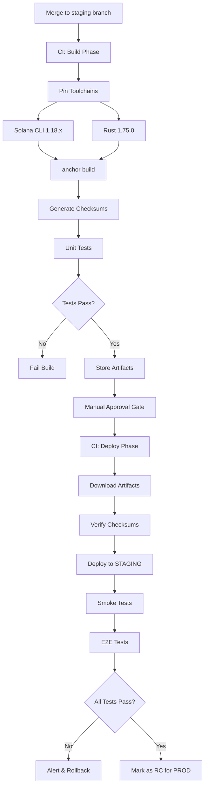

# STAGING Environment Strategy and Architecture

**Version:** 1.0  
**Last Updated:** 2025-01-20  
**Status:** Active  

---

## Table of Contents

1. [STAGING Environment Overview](#1-staging-environment-overview)
2. [Why Devnet for STAGING (Not Testnet)](#2-why-devnet-for-staging-not-testnet)
3. [Environment Separation Strategy](#3-environment-separation-strategy)
4. [Build-Once-Promote Pattern](#4-build-once-promote-pattern)
5. [CI/CD Requirements](#5-cicd-requirements)
6. [One-Time Setup](#6-one-time-setup)
7. [Upgrade Authority Management](#7-upgrade-authority-management)
8. [Program ID Tracking](#8-program-id-tracking)
9. [Canary Deployments and Rollback](#9-canary-deployments-and-rollback)
10. [What STAGING Provides](#10-what-staging-provides)
11. [Migration from DEV to STAGING](#11-migration-from-dev-to-staging)
12. [Mainnet-Shadow Testing](#12-mainnet-shadow-testing)

---

## 1. STAGING Environment Overview

### Purpose

STAGING is a **production-like testing environment** on devnet that serves as a **release candidate (RC) gate** before deploying to mainnet production. It is **NOT** a manual deployment environment.

### Key Principles

- **CI/CD Only**: All deployments must go through automated CI/CD pipelines
- **No Manual Deploys**: "SSH and deploy from laptop" is strictly forbidden
- **Production Parity**: Infrastructure, configuration, and topology mirror production
- **Safe Testing Ground**: Full production-like testing without real funds at risk

### Promotion Path

```
Local Development
    ↓
DEV Environment (devnet)
    ↓
STAGING Environment (devnet, prod-like) ← We are here
    ↓
PROD Environment (mainnet)
```

### Build-Once Philosophy

**Critical**: We build artifacts (program `.so` files and IDL) **once** and promote the **same artifacts** across all environments. We **never** rebuild for each environment.

```
Build Artifact Once → DEV → STAGING → PROD
(Same .so, Same IDL, Same Docker image)
```

---

## 2. Why Devnet for STAGING (Not Testnet)

### Network Comparison

| Network | Purpose | Stability | Faucet | Use Case |
|---------|---------|-----------|--------|----------|
| **Devnet** | Public testing playground | ✅ Stable | ✅ Yes | Application testing, STAGING |
| **Testnet** | Validator/core stress testing | ⚠️ Flaky | ⚠️ Limited | Runtime/validator testing |
| **Mainnet** | Production | ✅ Stable | ❌ No | Real transactions |

### Why Devnet is Ideal for STAGING

1. **Stable for Application Testing**
   - Devnet is designed and maintained for dApp developers
   - Predictable behavior and uptime
   - Well-documented RPC endpoints

2. **Free Testing with Faucet**
   - Unlimited SOL for testing via faucet
   - No real funds needed for comprehensive testing
   - Easy wallet funding and reset

3. **Production-Like Conditions**
   - Real RPC behavior (when using private endpoints)
   - Real transaction confirmation times
   - Real program deployment process

4. **Not Testnet Because:**
   - Testnet runs newer Solana branches (may be unstable)
   - Intended for validator operators, not dApps
   - Can have unexpected downtime
   - May not represent mainnet behavior

### Mainnet-Shadow (Separate Step)

For validating **true** production conditions that devnet cannot replicate:
- We will implement **mainnet-shadow testing** as a separate phase
- Small, gated transactions on real mainnet (tiny SOL amounts)
- Validates network congestion, actual RPC behavior, real fees
- **NOT part of STAGING** - runs after STAGING validates

---

## 3. Environment Separation Strategy

Even though both DEV and STAGING use devnet, they are **completely isolated**:

### Separate Program IDs

```
DEV Program ID:     4FQ5JoxsS5jjuTR1ScuEpk66eX5B71L7ysJEysmsTwhd
STAGING Program ID: <generated separately, Task 64>
PROD Program ID:    <will be generated for mainnet>
```

**Rationale:**
- DEV can be noisy (frequent deploys, breaking changes, experiments)
- STAGING must be clean and stable (RC testing only)
- Separate IDs prevent cross-environment contamination

### Separate RPC Endpoints

```
DEV:     https://api.devnet.solana.com (public, for rapid development)
STAGING: https://devnet.helius-rpc.com/v1/<api-key> (private, production-like)
PROD:    https://mainnet.helius-rpc.com/v1/<api-key> (private, production)
```

**Rationale:**
- Public RPC has rate limits that can cause test failures
- Private RPC provides production-like reliability
- Isolates rate limits between environments

### Separate Infrastructure

| Component | DEV | STAGING | PROD |
|-----------|-----|---------|------|
| **Database** | `easyescrow_dev` | `easyescrow_staging` | `easyescrow_prod` |
| **Redis** | DEV instance | STAGING instance | PROD instance |
| **Queues** | Shared DEV queues | Isolated STAGING queues | Isolated PROD queues |
| **Indexers** | DEV indexer | STAGING indexer | PROD indexer |
| **Monitoring** | DEV dashboard | STAGING dashboard | PROD dashboard |
| **Alerts** | DEV Slack channel | STAGING Slack channel | PROD PagerDuty |

**Rationale:**
- Prevents DEV churn from affecting STAGING tests
- Allows independent scaling and resource allocation
- Clear separation for debugging and monitoring

### Separate Wallets

```
DEV Wallets:
  DEVNET_SENDER_PRIVATE_KEY
  DEVNET_RECEIVER_PRIVATE_KEY
  DEVNET_ADMIN_PRIVATE_KEY
  DEVNET_FEE_COLLECTOR_PRIVATE_KEY

STAGING Wallets:
  DEVNET_STAGING_SENDER_PRIVATE_KEY
  DEVNET_STAGING_RECEIVER_PRIVATE_KEY
  DEVNET_STAGING_ADMIN_PRIVATE_KEY
  DEVNET_STAGING_FEE_COLLECTOR_PRIVATE_KEY
```

**Rationale:**
- Distinct wallets for independent balance management
- Easy to identify which environment a transaction belongs to
- Prevents accidental cross-environment usage

### Separate Anchor Configurations

```
Anchor.dev.toml      → DEV environment
Anchor.staging.toml  → STAGING environment
Anchor.prod.toml     → PROD environment (future)
```

**Rationale:**
- Environment-specific program IDs
- Environment-specific RPC URLs
- Environment-specific deployer keypairs
- Switch configs via `-C` flag or `ANCHOR_CONFIG` env var

---

## 4. Build-Once-Promote Pattern

### The CI/CD Pipeline



### Detailed Flow

#### **Phase 1: Build (Triggered on merge to staging branch)**

```bash
# 1. Pin Toolchains
solana-install init 1.18.x
rustup install 1.75.0

# 2. Build Program ONCE
anchor build

# 3. Generate Checksums
shasum -a 256 target/deploy/escrow.so > target/deploy/escrow.so.sha256
shasum -a 256 target/idl/escrow.json > target/idl/escrow.json.sha256

# 4. Run Unit Tests (no blockchain needed)
anchor test --skip-deploy

# 5. Store Artifacts
# Upload to GitHub Artifacts or artifact storage
# These same artifacts will be promoted to STAGING, then PROD
```

#### **Phase 2: Promote to STAGING (After manual approval)**

```bash
# 1. Download Build Artifacts
# Download the stored artifacts from Phase 1

# 2. Verify Checksums
shasum -a 256 -c target/deploy/escrow.so.sha256
shasum -a 256 -c target/idl/escrow.json.sha256

# 3. Deploy to STAGING
anchor deploy \
  -C Anchor.staging.toml \
  --provider.cluster devnet \
  --provider.wallet $STAGING_DEPLOYER_KEYPAIR

# 4. Update IDL
anchor idl upgrade $STAGING_PROGRAM_ID \
  target/idl/escrow.json \
  -C Anchor.staging.toml

# 5. Deploy Backend
doctl apps create-deployment $STAGING_APP_ID --wait

# 6. Run Tests
npm run test:staging:smoke
npm run test:staging:e2e
```

### Why This Pattern?

✅ **Reproducible**: Same artifact = same behavior  
✅ **Auditable**: Know exactly what was deployed where  
✅ **Safe**: Verified artifacts before deployment  
✅ **Fast**: No rebuild = faster deployments  
✅ **Traceable**: Git SHA → Artifact → Deployment  

---

## 5. CI/CD Requirements

### Mandatory Requirements

#### ❌ **FORBIDDEN**

```bash
# DO NOT DO THIS - Manual laptop deployment
ssh user@staging-server
git pull
anchor build
anchor deploy
```

**Why Forbidden:**
- Not reproducible (different toolchain versions)
- Not auditable (who deployed what when?)
- Not secure (local keys on laptops)
- Error-prone (manual steps)

#### ✅ **REQUIRED**

All deployments must go through **GitHub Actions** (or equivalent CI/CD system):

```yaml
# .github/workflows/staging-deploy.yml
name: Deploy to STAGING
on:
  workflow_run:
    workflows: ["Build"]
    types: [completed]

jobs:
  deploy:
    runs-on: ubuntu-latest
    environment: staging  # Manual approval required
    steps:
      - name: Download artifacts
      - name: Verify checksums
      - name: Deploy to STAGING
      - name: Run tests
      - name: Notify team
```

### CI/CD Best Practices

1. **Pinned Toolchains**
   ```toml
   # rust-toolchain.toml
   [toolchain]
   channel = "1.75.0"
   components = ["rustfmt", "clippy"]
   ```

2. **Artifact Verification**
   ```bash
   # Always verify checksums before deploying
   shasum -a 256 -c escrow.so.sha256 || exit 1
   ```

3. **Auditable Logs**
   - Log git commit SHA
   - Log deployer identity
   - Log deployment timestamp
   - Log transaction signatures

4. **Automatic Rollback**
   - Keep previous artifacts
   - Rollback script ready
   - Test rollback procedures

5. **Secret Management**
   - Use GitHub Secrets (not .env files in repo)
   - Rotate secrets regularly
   - Use least-privilege credentials

---

## 6. One-Time Setup

### Program IDs per Environment

Generate **separate keypairs** for each environment:

```bash
# DEV (already exists)
DEV_PROGRAM_ID: 4FQ5JoxsS5jjuTR1ScuEpk66eX5B71L7ysJEysmsTwhd

# STAGING (Task 64 - generate new)
solana-keygen new -o target/deploy/escrow-keypair-staging.json
STAGING_PROGRAM_ID=$(solana address -k target/deploy/escrow-keypair-staging.json)

# PROD (future - generate when ready for mainnet)
solana-keygen new -o target/deploy/escrow-keypair-prod.json
PROD_PROGRAM_ID=$(solana address -k target/deploy/escrow-keypair-prod.json)
```

**Storage:**
- Keep keypairs encrypted in secure store (DO NOT commit to git)
- Backup to multiple secure locations
- Document Program IDs in all relevant places

### Anchor Configuration Files

Create environment-specific Anchor configs:

```toml
# Anchor.dev.toml
[programs.devnet]
escrow = "4FQ5JoxsS5jjuTR1ScuEpk66eX5B71L7ysJEysmsTwhd"

# Anchor.staging.toml
[programs.devnet]
escrow = "<STAGING_PROGRAM_ID>"

# Anchor.prod.toml (future)
[programs.mainnet]
escrow = "<PROD_PROGRAM_ID>"
```

### CI Secrets Configuration

Configure in GitHub repository settings:

```
STAGING_DEPLOYER_KEYPAIR  # Base58 or JSON
STAGING_RPC_URL           # Private RPC endpoint
STAGING_PROGRAM_ID        # From keypair generation
STAGING_APP_ID            # DigitalOcean App Platform ID
DIGITAL_OCEAN_API_KEY     # For automated deployments
SLACK_WEBHOOK             # For notifications
```

### Switching Environments

```bash
# Use -C flag to specify config
anchor deploy -C Anchor.staging.toml

# Or set environment variable
export ANCHOR_CONFIG=Anchor.staging.toml
anchor deploy
```

---

## 7. Upgrade Authority Management

### Upgrade Authority Strategy

**DO NOT** keep upgrade authority on a laptop wallet!

#### Recommended Approaches

**Option 1: Multisig (Recommended for PROD)**
```bash
# Create multisig with 2-of-3 signers
squads create-multisig \
  --threshold 2 \
  --members $ADMIN1,$ADMIN2,$ADMIN3

# Transfer upgrade authority
solana program set-upgrade-authority \
  $PROGRAM_ID \
  --new-upgrade-authority $MULTISIG_ADDRESS
```

**Option 2: Hardware Wallet**
```bash
# Use Ledger or similar for upgrade authority
solana program set-upgrade-authority \
  $PROGRAM_ID \
  --new-upgrade-authority <hardware-wallet-address>
```

**Option 3: Immutable (Final State)**
```bash
# Make program immutable (cannot be upgraded)
solana program set-upgrade-authority \
  $PROGRAM_ID \
  --final
```

### Environment-Specific Authority

| Environment | Upgrade Authority | Rationale |
|-------------|-------------------|-----------|
| **DEV** | Single dev keypair | Fast iteration |
| **STAGING** | Single staging keypair or 2-of-3 multisig | Controlled, but flexible |
| **PROD** | 3-of-5 multisig | Maximum security |

### Emergency Upgrade Plan

Document and test:
1. Who holds upgrade authority?
2. How to coordinate multisig?
3. How to deploy emergency patch?
4. How to verify upgrade success?
5. Rollback procedure if upgrade fails

---

## 8. Program ID Tracking

### Master Registry

Maintain this table in all documentation:

| Environment | Network | Program ID | Status | Deployed | Upgrade Authority |
|-------------|---------|------------|--------|----------|-------------------|
| **DEV** | Devnet | `4FQ5JoxsS5jjuTR1ScuEpk66eX5B71L7ysJEysmsTwhd` | ✅ Active | 2025-01-15 | Dev team |
| **STAGING** | Devnet | `<from Task 64>` | 🔄 Setup | TBD | Staging deployer |
| **PROD** | Mainnet | `<future>` | ⏸️ Not deployed | TBD | 3-of-5 multisig |

### Where to Document

Update Program IDs in:
- ✅ `docs/STAGING_REFERENCE.md`
- ✅ `.env.staging` (as `DEVNET_STAGING_PROGRAM_ID`)
- ✅ `Anchor.staging.toml`
- ✅ `README.md` (environment table)
- ✅ Monitoring dashboards
- ✅ Team wikis
- ✅ Incident response playbooks

### Explorer Links

Always include explorer links for easy verification:

```
DEV:     https://explorer.solana.com/address/4FQ5JoxsS5jjuTR1ScuEpk66eX5B71L7ysJEysmsTwhd?cluster=devnet
STAGING: https://explorer.solana.com/address/<STAGING_ID>?cluster=devnet
PROD:    https://explorer.solana.com/address/<PROD_ID>
```

---

## 9. Canary Deployments and Rollback

### Canary Testing

After every STAGING deployment:

```bash
# 1. Deploy to STAGING
# 2. Run synthetic canary swaps
npm run canary:staging

# Canary tests:
# - Create test agreement
# - Deposit minimal amounts (0.001 SOL, 1 USDC)
# - Complete full swap cycle
# - Verify receipts and webhooks
# - Check all monitoring metrics
```

### Success Criteria

Deployment is successful if:
- ✅ All smoke tests pass
- ✅ All E2E tests pass
- ✅ Canary swaps complete successfully
- ✅ Error rate < 1%
- ✅ Response times within baseline
- ✅ No critical errors in logs

### Rollback Plan

Keep rollback time **under 5 minutes**:

```bash
# 1. Trigger rollback workflow
gh workflow run staging-rollback.yml \
  --field commit_sha=<previous-good-commit>

# 2. Rollback automatically:
# - Redeploys previous program version
# - Redeploys previous backend version
# - Runs smoke tests
# - Notifies team

# 3. Investigate issue offline
# - Review deployment logs
# - Check error messages
# - Identify root cause
# - Fix in DEV, then re-promote
```

### Keeping Previous Artifacts

```yaml
# GitHub Actions artifact retention
- uses: actions/upload-artifact@v3
  with:
    name: program-artifacts-${{ github.sha }}
    path: target/deploy/
    retention-days: 90  # Keep for rollback
```

---

## 10. What STAGING Provides

### Confidence for Production

STAGING gives us:

✅ **Stable RC Lane**
- Separate from DEV churn
- Dedicated Program ID and infrastructure
- Predictable, prod-like behavior

✅ **Production-Like Topology**
- Same API structure
- Same queue processing
- Same websocket behavior
- Same database schemas
- Same monitoring/metrics

✅ **Repeatable E2E Testing**
- Full swap cycles on devnet
- No real funds at risk
- Comprehensive test coverage
- Automated test execution

✅ **Performance Baseline**
- Load testing results
- Response time benchmarks
- Throughput measurements
- Resource utilization data

✅ **Security Gate**
- Vulnerability scanning
- Penetration testing
- Dependency audits
- Security review

✅ **Production Readiness**
- Proven deployment pipeline
- Tested rollback procedures
- Monitoring and alerting validated
- Team trained on processes

---

## 11. Migration from DEV to STAGING

### Promote Code, NOT Keys

**Critical Rule**: Each environment has its own credentials. Never reuse keys!

```bash
# ❌ WRONG
STAGING_WALLET=$DEV_WALLET

# ✅ CORRECT
STAGING_WALLET=<newly generated staging wallet>
```

### Migration Checklist

#### Database Migrations

1. **Test on STAGING first**
   ```bash
   # Run migration on STAGING database
   npx prisma migrate deploy --schema staging

   # Verify data integrity
   npm run verify:staging:data

   # If successful, document for PROD
   ```

2. **Backward Compatibility**
   - Ensure new code works with old schema
   - Deploy code that supports both schemas
   - Run migration
   - Deploy code using new schema only

#### Configuration Changes

```bash
# Update STAGING configs
# Do NOT copy from DEV - create fresh
DEVNET_STAGING_SENDER_PRIVATE_KEY=<new key>
DEVNET_STAGING_PROGRAM_ID=<staging program id>
```

#### Full Test Suite

Before marking RC ready:

```bash
# 1. Smoke tests
npm run test:staging:smoke

# 2. E2E tests
npm run test:staging:e2e

# 3. Load tests
npm run test:staging:load

# 4. Security tests
npm run test:staging:security

# 5. Canary tests
npm run canary:staging
```

---

## 12. Mainnet-Shadow Testing

### Overview

**Mainnet-shadow** is a **separate testing phase** from STAGING, used to validate conditions that devnet cannot replicate.

### When to Use

Use mainnet-shadow for:
- Real network congestion testing
- Actual mainnet RPC behavior
- Real transaction fee dynamics
- Production-like confirmation times
- Mainnet-specific edge cases

### Mainnet-Shadow Setup

```bash
# 1. Deploy separate program to mainnet
SHADOW_PROGRAM_ID=<separate mainnet program>

# 2. Create gated mainnet wallets
# Fund with minimal SOL (0.1-0.5 SOL)

# 3. Run controlled tests
# - Max transaction value: $1-5
# - Gated access (feature flags)
# - Admin-only initially
# - Extensive monitoring
```

### Safety Controls

1. **Transaction Limits**
   ```typescript
   const MAX_SHADOW_AMOUNT_USDC = 5; // $5 max
   const MAX_SHADOW_SOL = 0.01; // 0.01 SOL max
   ```

2. **Feature Flags**
   ```typescript
   if (!process.env.ENABLE_MAINNET_SHADOW) {
     throw new Error('Mainnet shadow not enabled');
   }
   ```

3. **Monitoring**
   - Alert on every mainnet-shadow transaction
   - Track costs closely
   - Set budget limits
   - Auto-disable if limits exceeded

### NOT Part of STAGING

**Important**: Mainnet-shadow testing:
- ❌ Is NOT part of STAGING environment
- ❌ Does NOT block STAGING → PROD promotion
- ✅ Is an optional validation step
- ✅ Runs after STAGING validates
- ✅ Provides additional confidence

---

## Related Documentation

- [STAGING Reference Guide](../STAGING_REFERENCE.md) - Program IDs, wallets, infrastructure
- [CI/CD Pipeline](../deployment/STAGING_CI_CD_COMPLETE.md) - Complete pipeline docs
- [Anchor Config Setup](../deployment/ANCHOR_CONFIG_SETUP.md) - Config file details
- [Rollback Procedures](../operations/STAGING_ROLLBACK_PROCEDURES.md) - Emergency rollback
- [Testing Strategy](../testing/STAGING_E2E_RESULTS.md) - Test coverage

---

## Revision History

| Version | Date | Changes | Author |
|---------|------|---------|--------|
| 1.0 | 2025-01-20 | Initial STAGING strategy document | AI Agent |

---

**Questions or Updates?** Contact the DevOps team or update this document via PR.

