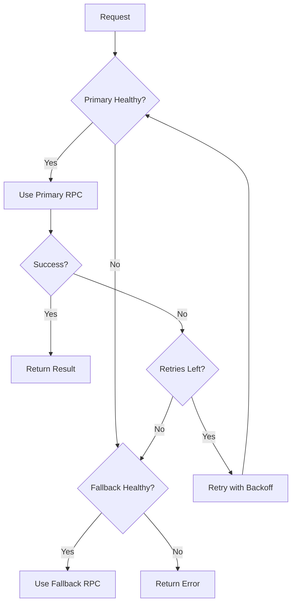

# STAGING RPC Provider Setup Guide

This document provides comprehensive instructions for setting up and managing dedicated RPC endpoints for the STAGING environment to ensure reliable blockchain connectivity and avoid rate limiting issues.

## Table of Contents
- [Overview](#overview)
- [RPC Provider Selection](#rpc-provider-selection)
- [Setup Instructions](#setup-instructions)
- [Configuration](#configuration)
- [Monitoring and Health Checks](#monitoring-and-health-checks)
- [Failover Strategy](#failover-strategy)
- [Security and API Key Management](#security-and-api-key-management)
- [Troubleshooting](#troubleshooting)
- [Performance Optimization](#performance-optimization)

---

## Overview

### Why Dedicated RPC Endpoints?

Public Solana devnet RPC endpoints have strict rate limits that can cause:
- **429 Too Many Requests errors** during testing and development
- **Unpredictable latency** due to shared infrastructure
- **Service interruptions** during high-traffic periods
- **Failed transactions** and incomplete operations

Dedicated RPC providers offer:
- ✅ **Higher rate limits** (100+ req/sec on free tiers)
- ✅ **Consistent performance** with dedicated resources
- ✅ **Better uptime guarantees** (99.9%+ SLA)
- ✅ **Advanced features** like connection pooling and analytics
- ✅ **Predictable costs** with transparent pricing

### Recommended Providers

| Provider | Free Tier | Devnet Support | Rate Limit | Notable Features |
|----------|-----------|----------------|------------|------------------|
| **Helius** | ✅ Yes | ✅ Yes | 100 req/sec | Best free tier, excellent docs |
| **QuickNode** | 7-day trial | ✅ Yes | Varies | Easy setup, good dashboard |
| **Alchemy** | ✅ Yes | ✅ Yes | 50 req/sec | Robust analytics |
| **Triton (RPC Pool)** | ✅ Yes | ✅ Yes | 100 req/sec | Geographic distribution |

**Recommendation**: **Helius** for STAGING due to generous free tier and reliable devnet support.

---

## RPC Provider Selection

### Step 1: Sign Up for Helius

1. Visit [Helius Dashboard](https://dashboard.helius.dev/)
2. Sign up for a free account
3. Verify your email address
4. Navigate to "API Keys" section

### Step 2: Create Devnet Project

1. Click **"Create New Project"**
2. Select **"Devnet"** as the network
3. Name your project: `easy-escrow-staging`
4. Click **"Create"**

### Step 3: Get Your API Key

1. Copy the generated API key
2. Your RPC URL will be: `https://devnet.helius-rpc.com/?api-key=YOUR_API_KEY`
3. Store this securely (see [Security](#security-and-api-key-management))

### Alternative: QuickNode Setup

1. Visit [QuickNode](https://www.quicknode.com/)
2. Start 7-day free trial
3. Create endpoint → Select Solana → Select Devnet
4. Copy the HTTP Provider URL
5. Store securely

---

## Setup Instructions

### Step 1: Update Environment Variables

Create or update your `.env.staging` file:

```bash
# Primary RPC Endpoint (Helius)
SOLANA_RPC_URL=https://devnet.helius-rpc.com/?api-key=YOUR_HELIUS_API_KEY

# Fallback RPC Endpoint (Public Devnet)
SOLANA_RPC_URL_FALLBACK=https://api.devnet.solana.com

# RPC Configuration
SOLANA_RPC_TIMEOUT=30000          # 30 seconds
SOLANA_RPC_RETRIES=3              # 3 retry attempts
SOLANA_RPC_HEALTH_CHECK_INTERVAL=30000  # 30 seconds

# Network
SOLANA_NETWORK=devnet
```

### Step 2: Verify Configuration

Test your RPC connection:

```bash
# Using Solana CLI
solana cluster-version --url https://devnet.helius-rpc.com/?api-key=YOUR_API_KEY

# Expected output:
# devnet 1.18.x (or current version)
```

### Step 3: Test with Application

```bash
# Start the application with staging config
npm run dev

# Check logs for successful connection:
# [SolanaService] Initialized with primary RPC: https://devnet.helius-rpc.com/...
# [SolanaService] Fallback RPC configured: https://api.devnet.solana.com
# [SolanaService] Health check passed for https://devnet.helius-rpc.com/... - Latency: XXms
```

---

## Configuration

### Environment Variables Reference

| Variable | Required | Default | Description |
|----------|----------|---------|-------------|
| `SOLANA_RPC_URL` | ✅ Yes | - | Primary RPC endpoint URL |
| `SOLANA_RPC_URL_FALLBACK` | ⚠️ Recommended | Public devnet | Fallback RPC endpoint |
| `SOLANA_RPC_TIMEOUT` | No | 30000 | Request timeout in milliseconds |
| `SOLANA_RPC_RETRIES` | No | 3 | Max retry attempts per request |
| `SOLANA_RPC_HEALTH_CHECK_INTERVAL` | No | 30000 | Health check interval in ms |
| `SOLANA_NETWORK` | ✅ Yes | - | Network identifier (devnet) |

### Connection Optimization

The `SolanaService` includes built-in optimizations:

#### 1. **Automatic Failover**
- Detects unhealthy primary endpoint
- Automatically switches to fallback
- Switches back when primary recovers

#### 2. **Retry Logic with Exponential Backoff**
```typescript
// Retry delays: 1s → 2s → 4s → max 10s
// Configurable via SOLANA_RPC_RETRIES
```

#### 3. **Response Time Tracking**
```typescript
// Metrics tracked per endpoint:
{
  url: string;
  isHealthy: boolean;
  lastResponseTime: number;  // in milliseconds
  failureCount: number;
  totalRequests: number;
  successfulRequests: number;
}
```

#### 4. **Health Checks**
- Periodic health checks every 30 seconds (configurable)
- Tracks endpoint status and latency
- Automatic recovery detection

---

## Monitoring and Health Checks

### View RPC Status

Add a health check endpoint to your API:

```typescript
// src/routes/health.routes.ts
import { getSolanaService } from '../services/solana.service';

router.get('/health/rpc', (req, res) => {
  const solanaService = getSolanaService();
  const rpcStatus = solanaService.getRpcStatus();
  
  res.json({
    status: rpcStatus.primary.isHealthy || rpcStatus.fallback?.isHealthy ? 'healthy' : 'unhealthy',
    usingFallback: rpcStatus.usingFallback,
    primary: {
      url: rpcStatus.primary.url,
      healthy: rpcStatus.primary.isHealthy,
      lastCheck: rpcStatus.primary.lastCheck,
      responseTime: rpcStatus.primary.lastResponseTime,
      successRate: rpcStatus.primary.totalRequests > 0
        ? (rpcStatus.primary.successfulRequests / rpcStatus.primary.totalRequests * 100).toFixed(2)
        : 'N/A',
    },
    fallback: rpcStatus.fallback ? {
      url: rpcStatus.fallback.url,
      healthy: rpcStatus.fallback.isHealthy,
      lastCheck: rpcStatus.fallback.lastCheck,
      responseTime: rpcStatus.fallback.lastResponseTime,
      successRate: rpcStatus.fallback.totalRequests > 0
        ? (rpcStatus.fallback.successfulRequests / rpcStatus.fallback.totalRequests * 100).toFixed(2)
        : 'N/A',
    } : null,
  });
});
```

### Example Health Response

```json
{
  "status": "healthy",
  "usingFallback": false,
  "primary": {
    "url": "https://devnet.helius-rpc.com/...",
    "healthy": true,
    "lastCheck": "2024-01-15T10:30:00Z",
    "responseTime": 145,
    "successRate": "99.87"
  },
  "fallback": {
    "url": "https://api.devnet.solana.com",
    "healthy": true,
    "lastCheck": "2024-01-15T10:30:00Z",
    "responseTime": 320,
    "successRate": "98.50"
  }
}
```

### Monitoring Best Practices

1. **Set Up Alerts**
   - Alert when both endpoints are unhealthy
   - Alert when response time exceeds thresholds (e.g., > 2s)
   - Alert on high failure rates (e.g., > 5%)

2. **Track Metrics**
   - Response time trends
   - Success/failure rates
   - Failover frequency
   - Total request volume

3. **Log Analysis**
   - Review logs for RPC errors
   - Track failover events
   - Monitor retry patterns

---

## Failover Strategy

### How Failover Works



### Automatic Recovery

- **Primary Recovery**: System automatically switches back to primary when it becomes healthy
- **Failure Threshold**: Endpoint marked unhealthy after consecutive failures
- **Recovery Check**: Health checks continue for unhealthy endpoints

### Manual Failover Testing

Test failover behavior:

```bash
# 1. Start application
npm run dev

# 2. Monitor logs for primary connection

# 3. Temporarily disable primary (set invalid API key)
# Edit .env.staging: SOLANA_RPC_URL=https://devnet.helius-rpc.com/?api-key=INVALID

# 4. Restart and observe automatic failover to secondary
npm run dev

# Expected logs:
# [SolanaService] Primary RPC unhealthy, switching to fallback
# [SolanaService] Health check passed for https://api.devnet.solana.com

# 5. Restore primary and observe recovery
# [SolanaService] Primary RPC recovered, switching back from fallback
```

---

## Security and API Key Management

### API Key Storage

**❌ NEVER:**
- Commit API keys to version control
- Share API keys in plaintext
- Use production keys in development

**✅ DO:**
- Store in `.env.staging` (gitignored)
- Use environment-specific keys
- Rotate keys regularly
- Limit key permissions to devnet only

### Environment-Specific Configuration

```bash
# Development (.env.dev)
SOLANA_RPC_URL=http://localhost:8899

# Staging (.env.staging)
SOLANA_RPC_URL=https://devnet.helius-rpc.com/?api-key=STAGING_KEY
SOLANA_RPC_URL_FALLBACK=https://api.devnet.solana.com

# Production (.env.production)
SOLANA_RPC_URL=https://mainnet.helius-rpc.com/?api-key=PRODUCTION_KEY
SOLANA_RPC_URL_FALLBACK=https://mainnet-fallback.helius-rpc.com/?api-key=PRODUCTION_KEY_2
```

### Key Rotation Procedures

1. **Generate New API Key** in provider dashboard
2. **Update `.env.staging`** with new key
3. **Test connection** using health check endpoint
4. **Deploy updated configuration** to STAGING environment
5. **Verify application functionality**
6. **Revoke old API key** in provider dashboard
7. **Document rotation** in key management log

### Access Control

- Limit API key access to authorized personnel
- Use separate keys for CI/CD pipelines
- Enable IP restrictions if provider supports it
- Monitor API key usage in provider dashboard

---

## Troubleshooting

### Common Issues and Solutions

#### Issue 1: 429 Rate Limit Errors

**Symptoms:**
```
Error: 429 Too Many Requests
```

**Solutions:**
1. Verify you're using dedicated RPC endpoint (not public)
2. Check provider dashboard for rate limit status
3. Implement client-side rate limiting if needed
4. Consider upgrading to paid tier if consistently hitting limits

#### Issue 2: High Latency

**Symptoms:**
```
[SolanaService] Health check passed - Latency: 3500ms
```

**Solutions:**
1. Check network connectivity
2. Verify RPC provider status page
3. Test alternative geographic endpoints
4. Consider switching to closer provider region
5. Increase `SOLANA_RPC_TIMEOUT` if operations are legitimate

#### Issue 3: Frequent Failovers

**Symptoms:**
```
[SolanaService] Primary RPC unhealthy, switching to fallback
[SolanaService] Primary RPC recovered, switching back from fallback
```

**Solutions:**
1. Check primary RPC provider status
2. Verify API key is valid
3. Review provider rate limits
4. Check for network issues
5. Consider upgrading provider plan

#### Issue 4: Connection Timeouts

**Symptoms:**
```
Error: Health check timeout
```

**Solutions:**
1. Increase `SOLANA_RPC_TIMEOUT` value
2. Check network connectivity
3. Verify RPC endpoint is reachable
4. Test with `curl` or `solana` CLI
5. Check firewall/proxy settings

### Diagnostic Commands

```bash
# Test RPC endpoint directly
curl -X POST https://devnet.helius-rpc.com/?api-key=YOUR_KEY \
  -H "Content-Type: application/json" \
  -d '{"jsonrpc":"2.0","id":1,"method":"getVersion"}'

# Test with Solana CLI
solana cluster-version --url YOUR_RPC_URL

# Check network connectivity
ping devnet.helius-rpc.com

# Test DNS resolution
nslookup devnet.helius-rpc.com
```

### Logging for Debugging

Enable verbose logging:

```bash
# .env.staging
LOG_LEVEL=debug

# Application logs will show detailed RPC information:
# [SolanaService] Creating primary connection with URL: ...
# [SolanaService] Health check passed for ... - Latency: 145ms
# [SolanaService] getAccountInfo(...) - Response time: 120ms
```

---

## Performance Optimization

### Best Practices

1. **Connection Reuse**
   - Use singleton `SolanaService` instance
   - Avoid creating multiple connections

2. **Batch Requests**
   ```typescript
   // ✅ Good: Batch multiple account queries
   const accounts = await solanaService.getMultipleAccountsInfo([addr1, addr2, addr3]);
   
   // ❌ Bad: Individual queries
   const acc1 = await solanaService.getAccountInfo(addr1);
   const acc2 = await solanaService.getAccountInfo(addr2);
   const acc3 = await solanaService.getAccountInfo(addr3);
   ```

3. **Caching**
   - Cache account data when appropriate
   - Use Redis for shared caching across instances
   - Set appropriate TTL based on data volatility

4. **Commitment Levels**
   ```typescript
   // Use appropriate commitment for your use case:
   // - 'processed': Fastest, least secure (use for UI updates)
   // - 'confirmed': Balanced (default, recommended)
   // - 'finalized': Slowest, most secure (use for critical operations)
   ```

5. **Rate Limiting**
   ```typescript
   // Implement client-side rate limiting
   // Example with p-limit:
   import pLimit from 'p-limit';
   
   const limit = pLimit(10); // Max 10 concurrent requests
   const results = await Promise.all(
     addresses.map(addr => limit(() => solanaService.getAccountInfo(addr)))
   );
   ```

### Provider-Specific Optimizations

#### Helius
- Use WebSocket subscriptions for real-time updates
- Leverage enhanced APIs (getParsedTransaction, etc.)
- Enable compression for reduced bandwidth

#### QuickNode
- Use add-ons for additional features
- Configure global caching settings
- Enable request logging for debugging

### Monitoring Performance

Track these metrics:
- Average response time
- 95th percentile response time
- Request success rate
- Failover frequency
- Total throughput (req/sec)

---

## Production Considerations

### Scaling for Production

When moving to mainnet:

1. **Use Mainnet-Specific RPC Providers**
   ```bash
   SOLANA_RPC_URL=https://mainnet.helius-rpc.com/?api-key=PROD_KEY
   SOLANA_RPC_URL_FALLBACK=https://mainnet-backup.helius-rpc.com/?api-key=PROD_KEY_2
   ```

2. **Upgrade to Paid Tiers**
   - Higher rate limits
   - Better SLA guarantees
   - Priority support
   - Advanced analytics

3. **Implement Multiple Fallbacks**
   ```bash
   SOLANA_RPC_URL=https://mainnet.helius-rpc.com/?api-key=PRIMARY
   SOLANA_RPC_URL_FALLBACK=https://mainnet.quicknode.pro/SECONDARY
   SOLANA_RPC_URL_FALLBACK_2=https://api.mainnet-beta.solana.com
   ```

4. **Geographic Distribution**
   - Use providers with multiple regions
   - Route traffic to nearest endpoint
   - Consider CDN for global distribution

5. **Monitoring and Alerting**
   - Set up comprehensive monitoring (Datadog, New Relic, etc.)
   - Configure alerts for critical metrics
   - Implement incident response procedures
   - Regular performance reviews

### Cost Management

- Monitor usage in provider dashboards
- Set up billing alerts
- Optimize request patterns
- Use caching aggressively
- Consider request bundling

---

## Additional Resources

### Provider Documentation
- [Helius Documentation](https://docs.helius.dev/)
- [QuickNode Documentation](https://www.quicknode.com/docs/solana)
- [Alchemy Documentation](https://docs.alchemy.com/reference/solana-api-quickstart)
- [Triton Documentation](https://docs.triton.one/)

### Solana Resources
- [Solana RPC API Reference](https://docs.solana.com/api/http)
- [Solana Web3.js Documentation](https://solana-labs.github.io/solana-web3.js/)
- [Solana Cookbook](https://solanacookbook.com/)

### Internal Documentation
- [Environment Setup](../setup/ENVIRONMENT_SETUP.md)
- [Deployment Guide](../deployment/DEPLOYMENT_GUIDE.md)
- [Architecture Overview](../architecture/ARCHITECTURE.md)

---

## Support and Contact

### Getting Help

1. **Provider Support**
   - Check provider status page
   - Review provider documentation
   - Contact provider support (if paid tier)

2. **Team Support**
   - Consult with DevOps team
   - Review internal runbooks
   - Escalate to infrastructure team

3. **Community Resources**
   - Solana Discord
   - Solana Stack Exchange
   - Provider community forums

---

**Document Version:** 1.0.0  
**Last Updated:** January 2024  
**Maintained By:** Infrastructure Team  
**Review Schedule:** Quarterly

